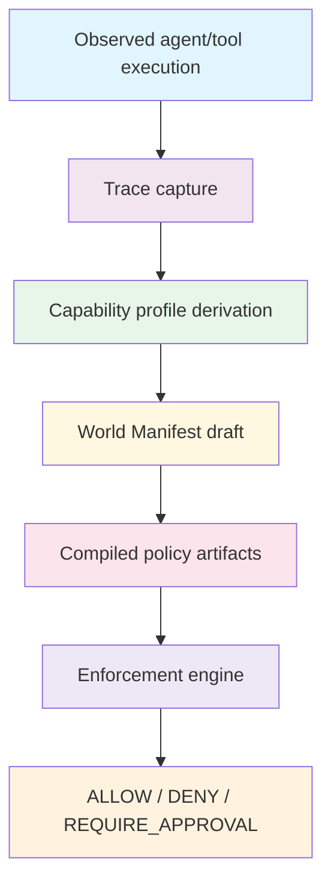
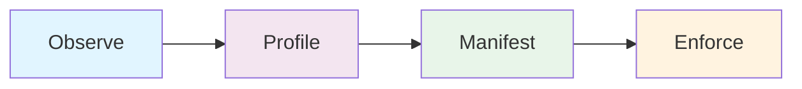
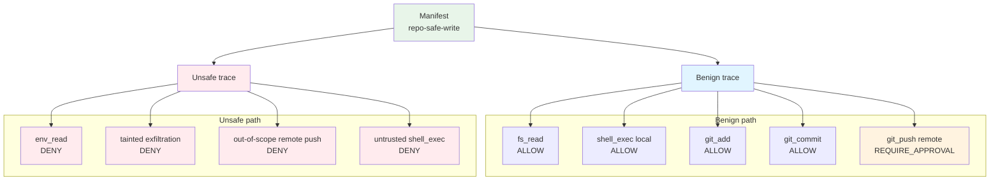

# Diagrams

## Diagram 1 — High-level architecture

Purpose:
Show the relationship between traces, capability profiles, World Manifests, compiled policy, and enforcement.

What it should communicate:

- execution is observed first;
- policy is derived and compiled before enforcement;
- decisions are deterministic at runtime.

Suggested source:
`summit/assets/architecture.mmd`

## Diagram 2 — The Pipeline

Purpose:
Make the full pipeline legible in one slide.

What it should communicate:

- benign execution becomes a bounded profile;
- the profile becomes a declarative manifest;
- the manifest drives policy decisions.

Suggested source:
`summit/assets/observe-profile-manifest-enforce.mmd`

## Diagram 3 — Benign vs unsafe trace outcomes

Purpose:
Show the same manifest applied to two traces with different outcomes.

What it should communicate:

- benign workflow mostly allowed;
- remote push escalated to approval;
- unsafe trace denied by multiple independent policy checks.

Suggested source:
`summit/assets/repo-safe-write-flow.mmd`
